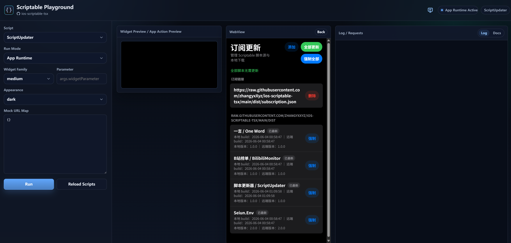

# ios-scriptable-tsx

[中文](./README.md) | [English](./README.en.md)

用 TypeScript / TSX 编写、调试并打包 [Scriptable](https://scriptable.app/) 脚本。这个仓库把常用运行时、组件化 Widget 写法、浏览器 Playground 和本地缓存模拟放在一起，让脚本可以先在桌面浏览器里跑通，再同步到 iOS Scriptable。


## 特性

- 使用 TypeScript / TSX 组织 Scriptable 脚本，入口由 `src/index.ts` 控制。
- 支持浏览器 Playground：Widget Preview、App Runtime WebView、请求日志和 Scriptable Docs 并排调试。
- App Runtime 会模拟真实点击、WebView 返回、Alert、Keychain、FileManager、Photos 文件选择等行为。
- 本地状态写入 `.cache`，包括 `.cache/keychain.json`、`.cache/Documents`、`.cache/Library`、`.cache/iCloud`、`.cache/images` 和 `.cache/tmp`，便于直接检查和重置。
- `Appearance` 控制 Widget / WebView 内部的 Scriptable 外观；页面自己的 Light / Dark / Auto 主题只影响 Playground 外壳。
- 内置离线 Scriptable Docs 预览，调试时不用频繁跳转到外部文档站点。
- 构建时生成 `dist/subscription.json`，可被 `ScriptUpdater.js` 在 Scriptable 内管理订阅、检查版本并更新脚本。

## 快速开始

安装依赖：

```bash
npm install
```

选择要编译的脚本。编辑 `src/index.ts`，引入需要输出的脚本：

```ts
import './scripts/Seiun.Env'
import './scripts/BilibiliMonitor'
```

单次开发构建：

```bash
npm run dev
```

生产构建：

```bash
npm run build
```

构建结果会输出到 `dist`。把业务脚本和它依赖的 `Seiun.Env.js` 放到 Scriptable 的同一目录即可运行。

## 构建产物与订阅清单

普通构建会解析 `src/index.ts` 中的静态 import，并把每个入口输出为 `dist/*.js`。构建完成后还会生成 `dist/subscription.json`，用于描述当前可订阅脚本：

- `rawUrl`：脚本远端 raw 地址，默认从 GitHub `origin` 和当前分支推断为 `https://raw.githubusercontent.com/<owner>/<repo>/<branch>/dist/<file>`。
- `name.zh` / `name.en`：脚本中文名和英文名，优先从脚本类里的 `this.name`、`this.en` 读取。
- `desc`：脚本头部注释里的 `desc`，没有时使用脚本名。
- `version`：脚本头部注释里的 `version`，没有版本号时回退为 build 时间。
- `build`：构建时间。

如果需要固定订阅 raw 根地址，可以在构建时设置：

```bash
$env:SUBSCRIPTION_RAW_BASE_URL='https://raw.githubusercontent.com/zhangyxXyz/ios-scriptable-tsx/main/dist'
npm run dev
```

构建器会先把候选产物写入 `dist/.tmp`，再和现有 `dist` 文件比较。比较时会把新文件的 build 时间临时替换为旧文件的 build 时间并计算 MD5；如果内容一致，就跳过覆盖，避免只有 build 时间变化导致 `dist` 产生无意义改动。没有旧 build 时间或内容确实变化时，会覆盖正式产物。构建成功后会清理 `dist/.tmp`。

## 脚本更新器

`dist/ScriptUpdater.js` 可在 Scriptable 内管理脚本订阅。默认使用本仓库的 `dist/subscription.json`，也可以添加多个订阅源。



- 订阅按来源分组展示。
- 有版本号时优先比较版本；版本号相同但远端 build 时间更新时也会提示更新；没有版本号时比较 build 时间。
- 需要更新时显示“更新”，已最新时显示“强制”。
- “全部更新”只下载需要更新的脚本；“强制全部”会覆盖下载全部脚本。

第一次在真机运行更新器时，如果本地没有 `Seiun.Env.js`，更新器会先下载依赖并重新拉起脚本。Playground 调试时，更新器会把当前 `dist` 产物视为本地脚本，不依赖 `.cache/Documents` 中的旧缓存。

## Playground 预览调试

启动带本地服务的开发模式：

```bash
npm run watch
```

终端会输出局域网地址和二维码。桌面调试可以直接打开：

```text
http://localhost:9090/playground
```

停止 watch：回到启动 `npm run watch` 的终端，按 `Ctrl+C`。在 Windows / PowerShell 里如果出现 `Terminate batch job (Y/N)?`，输入 `Y` 后回车。

Playground 默认以 `App Runtime` 运行，适合调试设置页、点击项、WebView、缓存和图片选择。切到 `Widget Preview` 时只渲染 Widget，适合确认 medium / large 等尺寸和 Appearance 下的最终显示。

常用调试入口：

- `Script`：选择 `src/index.ts` 当前导出的脚本。
- `Run Mode`：`App Runtime` 会拉起完整应用行为，`Widget Preview` 只渲染 Widget。
- `Widget Family`：模拟 Scriptable 的 `config.widgetFamily`，例如 `medium`、`large`。
- `Appearance`：模拟 Scriptable 的深浅色环境，直接影响 Widget / WebView 内部渲染。
- `Mock URL Map`：按 URL 写入自定义响应；不配置时会发起真实请求。
- `Log / Requests`：查看脚本日志、请求响应和运行时事件。
- `Docs`：在同一面板里查看离线 Scriptable 文档。

更多细节见 [Playground 调试指南](./docs/zh-CN/playground.md)。

## 本地缓存说明

Playground 会把 Scriptable 的存储行为映射到仓库根目录的 `.cache`：

```text
.cache/
  keychain.json
  Documents/
  Library/
  iCloud/
  images/
  tmp/
```

`Keychain` 使用脚本名作为命名空间，便于阅读和排查。同名脚本会共用同一份命名空间，因此建议脚本文件名保持唯一。通过浏览器文件选择设置的图片会真实保存到本地缓存，并在后续 Widget / WebView 渲染中继续使用。

## 文档

- [快速开始](./docs/zh-CN/quick-start.md)
- [Playground 调试指南](./docs/zh-CN/playground.md)
- [构建流程](./docs/zh-CN/build.md)
- [运行时环境](./docs/zh-CN/env.md)
- [Stack UI](./docs/zh-CN/stack-ui.md)
- [架构说明](./docs/zh-CN/architecture.md)

## License

[MIT](./LICENSE)
